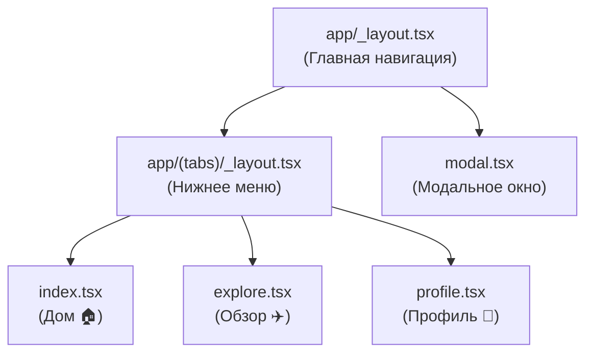

# Структура вашего React Native (Expo) проекта

Добро пожаловать в React Native! Ваш проект использует **Expo Router** — это современный способ создания навигации, где файлы и папки определяют структуру вашего приложения (похоже на Next.js или обычные веб-сайты).

Вот разбор основных элементов вашего проекта:

## 📂 Папка `app/`

Это самая главная папка. Всё, что лежит здесь, становится "экраном" или частью навигации вашего приложения.

### 1. Что такое `_layout.tsx`?

Файлы с именем `_layout.tsx` — это **Обертки (Wrappers)**.
Представьте, что это "рамка для картины". Рамка остается на месте, а картины внутри (страницы) меняются.

- **`app/_layout.tsx`**: Это **Главная рамка** всего приложения.

  - В ней обычно настраиваются шрифты, темы (светлая/темная) и глобальные провайдеры.
  - Она говорит приложению: "Внутри меня будет навигация (Stack)".

- **`app/(tabs)/_layout.tsx`**: Это **Рамка для вкладок**.
  - Она говорит: "Внутри меня экраны будут переключаться через нижнее меню (Tab Bar)".
  - Именно здесь вы настраиваете иконки, названия вкладок и их порядок.

### 2. Что значит `(tabs)`?

Папки в скобках, например `(tabs)`, — это **Группы**.

- Они **не влияют на URL** или путь навигации.
- Они нужны только для порядка в файлах.
- Это позволяет сгруппировать файлы `index`, `explore`, `profile` вместе и применить к ним общий `_layout` (тот самый, с нижним меню).

### 3. Экраны (Screens)

Это обычные файлы `.tsx`, которые экспортируют React-компонент.

- **`index.tsx`**: Это всегда "Главная страница" текущей папки.
  - `app/(tabs)/index.tsx` -> Это первый экран, который открывается в вкладках (обычно "Дом").
- **`explore.tsx`**: Дополнительный экран.
- **`profile.tsx`**: Экран профиля, который мы только что создали.

## 🧩 Как это работает вместе?



1.  Приложение запускается с `app/_layout.tsx`.
2.  Оно видит, что нужно показать группу `(tabs)`.
3.  Загружается `app/(tabs)/_layout.tsx`, который рисует нижнее меню.
4.  По умолчанию открывается `index.tsx`.

## ❓ Почему нижнее подчеркивание?

Файлы с `_` (как `_layout.tsx`) — это **служебные файлы** Expo Router. Они не являются обычными экранами, а управляют тем, _как_ экраны отображаются.

---

## 🏗 Архитектура Навигации (Подробно)

### 📚 Что такое `<Stack>`?

`Stack` (Стек) — это вид навигации, похожий на колоду карт.

- Когда вы открываете новый экран, он кладется **сверху** на предыдущий.
- Когда вы нажимаете "Назад", верхний экран сбрасывается, и вы видите предыдущий.
- В вашем приложении `Stack` используется как **Главный контейнер**. В нем лежат:
  1.  `(tabs)` — экран с вкладками (он в самом низу стека).
  2.  `modal` — модальное окно (оно открывается поверх вкладок).

### ⚡️ `import 'react-native-reanimated';`

Эта строка подключает библиотеку для **сложных анимаций**.

- React Native имеет встроенную анимацию, но она работает на процессоре (JS thread) и может тормозить.
- `Reanimated` запускает анимации в отдельном потоке (UI thread), поэтому они работают супер-плавно (60 FPS), даже если приложение занято.
- Она нужна для работы красивых переходов между экранами и анимации вкладок.

### 🔋 `<StatusBar style="auto" />`

Это компонент, который управляет **верхней полоской телефона** (там, где часы, заряд батареи и уровень сигнала).

- `style="auto"`: Автоматически меняет цвет текста (черный или белый) в зависимости от темы телефона (светлая или темная).
- **Где отображается:** В самом верху экрана вашего физического телефона или симулятора.
- **Зачем нужен:** Чтобы текст (время, заряд) был виден на вашем фоне. Например, если фон белый — текст должен быть черным, и наоборот.

### Как подключен TabLayout?

В файле `app/_layout.tsx` (Главная рамка) есть такой код:

```tsx
<Stack>
  <Stack.Screen name="(tabs)" options={{ headerShown: false }} />
</Stack>
```

Это и есть точка подключения!

1.  **Главный Layout** создает "стопку" экранов (`Stack`).
2.  Первым экраном в этой стопке он делает **всю папку `(tabs)`**.
3.  Поскольку внутри `(tabs)` есть свой `_layout.tsx`, Expo Router понимает: "Ага, внутри этой папки нужно показать не просто экран, а целое меню с вкладками".

### Как работают вкладки (Tabs)?

В файле `app/(tabs)/_layout.tsx`:

1.  Компонент `<Tabs>` создает нижнее меню.
2.  Каждый `<Tabs.Screen />` внутри него — это кнопка внизу.
    - `name="index"` -> ищет файл `index.tsx`
    - `name="profile"` -> ищет файл `profile.tsx`
3.  Если вы создадите файл, но не добавите `<Tabs.Screen />`, он все равно будет работать, но без красивой иконки и названия (Expo создаст кнопку автоматически).

### Что такое `unstable_settings`?

```tsx
export const unstable_settings = {
  anchor: '(tabs)',
};
```

Это настройка для **Deep Linking** (когда приложение открывается по ссылке).
Она говорит: "Если приложение открылось, но мы не знаем, какой экран показать, покажи папку `(tabs)` как главную". Это гарантирует, что пользователь всегда попадет на главный экран с вкладками при старте.
